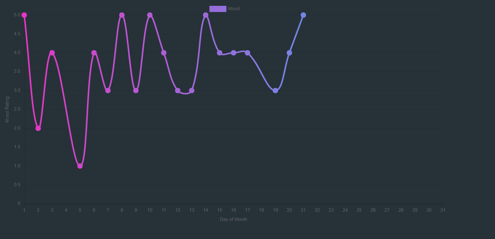

# Mood-App
Visual analytics Application that displays user mood data.



## About
The way I approached this project was simple. I wanted to create an application that could keep and visualize a history of individualized data.
I decided to use mood data, that is, how I was feeling at that particular time.  The data is recorded using a 1-5 range.  Only one mood can be recorded a day, and an optional comment can be attatched and displayed on the graph. 

## Technical Summary

-  **Backend:** Python
-  **Libraries:** Chart.js, 
-  **DB:** SQL - postgres
-  **Framework:** Flask
-  **ORM:** SQLAlchemy
-  **PaaS:** Heroku

## Getting Started

```
$ git clone https://github.com/m4rsibar/Mood-App.git
$ cd Mood-App/
$ pip install -r requirements.txt
$ python app.py
```
Or visit this link [https://mood-visualization.herokuapp.com/](https://mood-visualization.herokuapp.com/) using **Chrome's web   browser.**


## Features
- Performs CRUD operations.
- Data visualization.

## Milestones

- [x] Create a GitHub Repo and Start on a Project Plan
- [x] Get Familiarized with Chart.js documentation
- [x] Create Database and Tables.
- [x] Create frontend components
- [x] Use a http requests to get/post data to/from db

